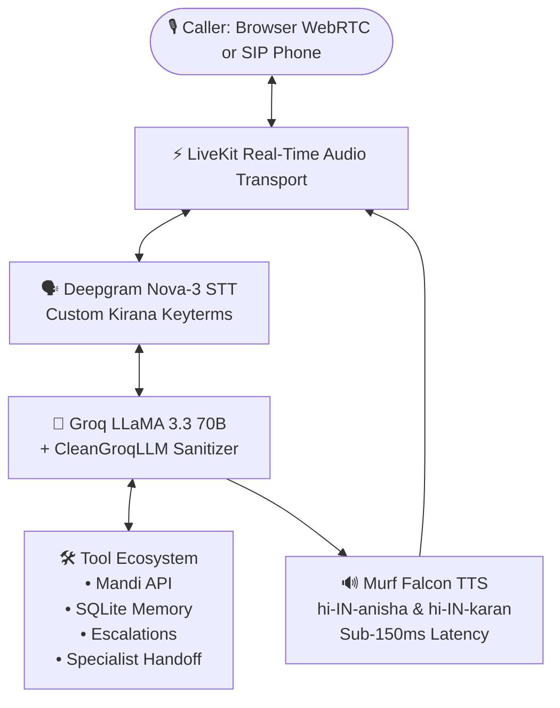

# Building Dukaan Saathi: A Production Voice AI Agent for India's Local Kirana Stores

*How I built a full-duplex, multilingual voice AI assistant with real-time commodity pricing, persistent memory, SIP outbound calling, human escalation, call analytics, and specialist agent handoffs in 10 days using Murf Falcon & LiveKit.*

---

## 📌 The Problem & The Mission

Across India, millions of neighborhood **Kirana (mom-and-pop grocery) stores** form the backbone of daily commerce. While large e-commerce apps require typing and complex UI navigation, local shoppers and shopkeepers have always relied on one natural interface: **their voice**.

Customers frequently call or walk in asking:
- *"Atta ka rate kya chal raha hai?"* (What's the current price of flour?)
- *"Pichhli bar wala saman bhej do."* (Send my usual monthly ration.)
- *"Kharab tel ka packet return karna hai."* (I need to return a damaged oil packet.)

Typing on keyboards or navigating complex apps is a friction point for small store owners. **Voice AI is the ultimate equalizer.**

For the **Murf AI #VoiceForBharat Challenge (10 Days of Voice Agents)**, I built **Dukaan Saathi (दुकान साथी)** — a production-ready, full-duplex digital voice assistant tailored specifically for India's local retail ecosystem.

---

## 🏗️ System Architecture

Dukaan Saathi processes spoken Hindi in real time with sub-150ms voice latency using the following pipeline:



### Core Technologies:
1. **TTS (Text-to-Speech)**: **[Murf Falcon](https://murf.ai/)** (`hi-IN-anisha` for main assistant, `hi-IN-karan` for specialist) — delivering ultra-fast, natural Indian voice synthesis.
2. **STT (Speech-to-Text)**: **Deepgram Nova-3** tuned with Indian retail keywords (*dukaan, aata, chawal, cheeni, udhaar, bhaiya*).
3. **LLM**: **Groq LLaMA 3.3 70B Versatile** for intelligent reasoning and tool calling.
4. **Transport**: **LiveKit WebRTC & SIP Telephony** for seamless browser and phone calls.
5. **Memory & Analytics**: **SQLite (`callers.db`)** via `aiosqlite` (Python backend) and `better-sqlite3` (Next.js dashboard).
6. **Frontend**: **Next.js 14, TypeScript & Tailwind CSS** with a 5-state 3D audio visualizer.

---

## 🚀 Key Features Built Over 10 Days

### 1. Ultra-Low Latency Natural Hindi Voice (Murf Falcon)
Using Murf Falcon's streaming TTS, responses feel instantaneous. The agent speaks strictly in natural Devanagari Hindi with proper gender agreement and polite Indian conversational grammar (*"नमस्ते! मैं दुकान साथी हूँ, बताइए आज क्या सामान चाहिए?"*).

### 2. Interactive 3D Visualizer & Real-Time Hinglish Transliteration
The Next.js frontend features a dynamic 5-State 3D Soap Bubble audio visualizer that reacts to agent states (*Listening, Thinking, Speaking, Idle, Error*) and provides real-time Hinglish transliteration for spoken Devanagari Hindi.

### 3. Persistent Caller Memory with Verbal Consent
The agent recognizes returning customers by their phone or participant ID:
- It greets returning customers warmly and recalls past orders (*"नमस्ते अनिकेत जी! पिछली बार आपने 5 kg आटा और 1 kg दाल ली थी..."*).
- **Consent Guardrail**: Before saving any customer preference, the agent explicitly asks for verbal permission (*"क्या मैं यह जानकारी याद रख सकती हूँ?"*).

### 4. Live Mandi Commodity Price Lookup (data.gov.in API)
Connected the agent to the **Government of India’s Open Mandi API (data.gov.in AGMARKNET)** with an automatic local catalog fallback (`prices_local.json`). When a customer asks *"Pyaaz ka rate kya hai?"*, it checks live prices in milliseconds.

### 5. Outbound Phone Calling via SIP (Linphone)
Dukaan Saathi doesn't just receive calls — it proactively makes outbound restock reminder phone calls over SIP trunking to remind customers before their monthly groceries run out.

### 6. Human Escalation System & Dedicated Owner Dashboard
When issues exceed the agent’s scope (e.g., payment disputes, damaged bulk orders), it asks permission and creates an escalation ticket (`TKT-XXXXXX`). Store owners manage these in a real-time **Human Escalation Dashboard** (`/escalations`).

### 7. Live Call Analytics Dashboard
A real-time analytics web dashboard (`/dashboard`) tracking:
- **Total Calls, Successful Calls, Failed Calls** (100% real data from SQLite).
- **Channel Breakdown** (WebRTC vs. SIP Phone).
- **Failure Classification** (Early hangup, out of stock, incomplete enquiry).
- **Privacy Protection**: Zero transcripts, passwords, or PII exposed.

### 8. Specialist Agent Handoff (Returns & Refunds)
One agent shouldn't do everything. For product returns, the main agent (`Assistant` / Anisha) announces a transfer and hands the call to the **Returns Specialist (`ReturnsAgent` / Karan)**. The conversation context is passed automatically so the user never repeats themselves, and the specialist can transfer the caller back when finished!

---

## 🛠️ Real Engineering Challenges & How I Solved Them

### Challenge 1: LLM Function Tag Leakage in Audio Streams
**Problem**: During rapid streaming, the LLM occasionally output raw function tags (`<function=check_price>{"item": "atta"}</function>`) directly into the text stream, causing the TTS to read raw code aloud.
**Solution**: Built a custom stream interceptor, `CleanGroqLLM`, which regex-filters function syntax and JSON artifacts in real time before sending text chunks to the Murf TTS stream.

### Challenge 2: Windows UTF-8 Terminal Logging Crash
**Problem**: When logging Hindi Devanagari transcripts on Windows, Python threw `UnicodeEncodeError: 'charmap' codec can't encode character`.
**Solution**: Reconfigured standard output at the top of the backend entry point:
```python
import sys
if sys.stdout.encoding.lower() != 'utf-8':
    sys.stdout.reconfigure(encoding='utf-8')
if sys.stderr.encoding.lower() != 'utf-8':
    sys.stderr.reconfigure(encoding='utf-8')
```

### Challenge 3: Matching Official Murf Falcon Voice Catalog
**Problem**: Attempting to use Gen2 voice IDs with the ultra-low latency Falcon model returned `Invalid voice_id: hi-IN-kabir`.
**Solution**: Queried Murf's official voice catalog endpoint (`GET https://api.murf.ai/v1/speech/voices?model=FALCON`) to inspect and test live audio synthesis. We configured **`hi-IN-anisha`** for the female main assistant and **`hi-IN-karan`** for the male returns specialist.

---

## 💻 How You Can Build & Run Dukaan Saathi

### Prerequisites:
- Python 3.10+ with `uv`
- Node.js 18+ with `pnpm` / `npm`
- API Keys: [Murf AI](https://murf.ai/api), [LiveKit Cloud](https://cloud.livekit.io), [Deepgram](https://deepgram.com), [Groq](https://groq.com)

### 1. Clone the Repository
```bash
git clone https://github.com/aniketdubey1204-code/murf-livekit-starter.git
cd murf-livekit-starter
```

### 2. Configure Environment Secrets
Create `backend/.env.local` and `frontend/.env.local`:
```env
LIVEKIT_URL=wss://your-project.livekit.cloud
LIVEKIT_API_KEY=your_api_key
LIVEKIT_API_SECRET=your_api_secret
MURF_API_KEY=your_murf_falcon_key
DEEPGRAM_API_KEY=your_deepgram_key
GROQ_API_KEY=your_groq_key
```

### 3. Run the App (One-Click)
```powershell
# Windows
.\start_app.ps1

# Linux / macOS
./start_app.sh
```
Open **`http://localhost:3000`** in your browser, click **Start Talking**, and speak in Hindi! Access the analytics at **`http://localhost:3000/dashboard`**.

---

## 🔮 What's Next?

- 📦 **Direct UPI Payment Links**: Automatically sending WhatsApp payment links upon order confirmation.
- 🗣️ **Regional Language Support**: Expanding from Hindi/Hinglish to Tamil, Telugu, and Marathi using Murf Falcon's multilingual voice suite.
- 📱 **WhatsApp Voice Note Ingestion**: Allowing customers to forward voice notes for automated order processing.

---

## 🔗 Links & Resources

- 💻 **GitHub Repository**: [aniketdubey1204-code/murf-livekit-starter](https://github.com/aniketdubey1204-code/murf-livekit-starter)
- ⚡ **Murf AI Falcon TTS**: [murf.ai/api](https://murf.ai/api)
- 🌐 **LiveKit Real-Time Agents**: [docs.livekit.io](https://docs.livekit.io)

*Special thanks to the Murf AI team for hosting the #VoiceForBharat Challenge!*
